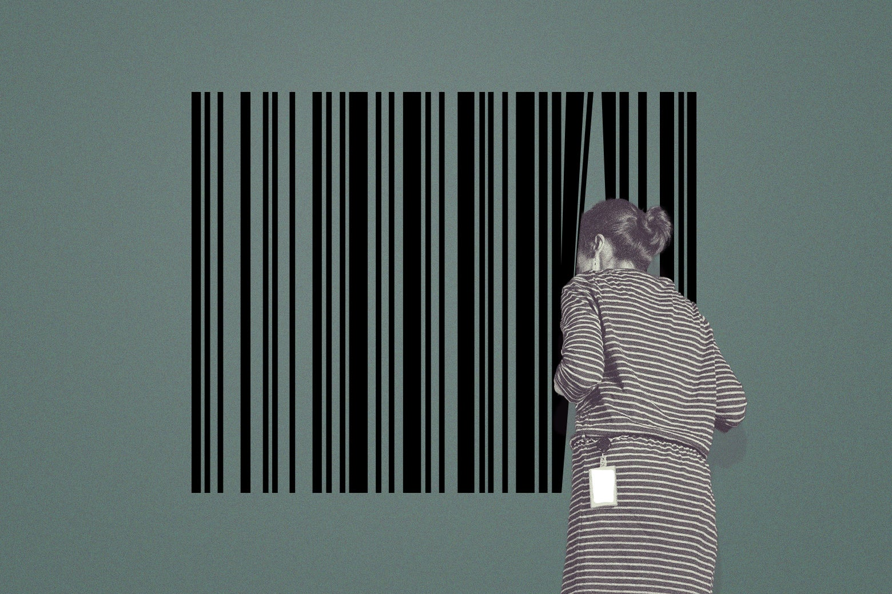

<h3 style="text-align: center;">
  
</h3>

---

<p align="center">
  
</p>
<h1 align="center">
<br>
BarSight: Barcode & QR Code Detection and Decoding App
</h1>

---

## Problem Background

Barcode dan QR code banyak digunakan dalam logistik, produk retail, dan sistem pelacakan. Namun, banyak sistem pemindaian masih kesulitan membaca barcode yang rusak, miring, atau buram. Oleh karena itu, dibutuhkan solusi yang mampu mendeteksi posisi barcode/QR dalam gambar dan secara otomatis membaca isinya, bahkan dalam kondisi sulit sekalipun.

## Objective & User

Proyek ini bertujuan membangun pipeline end-to-end untuk:
- Mendeteksi lokasi barcode dan QR code pada gambar menggunakan YOLOv8.
- Melakukan decoding isi barcode/QR dengan pyzbar dan ZXing.
- Menyimpan hasil decoding ke file CSV dan menampilkan gambar hasil deteksi.

Aplikasi ini berguna untuk:
- Tim logistik yang membutuhkan sistem robust.
- Developer yang ingin membangun pemindai barcode otomatis.

## Dataset

Dataset yang digunakan adalah hasil gabungan dari berbagai barcode dan QR code realistis. Gambar memiliki berbagai rotasi, kondisi pencahayaan, dan kualitas (blur, robek, dll). Dataset terdiri dari ±3000 gambar dan telah dibagi ke dalam folder `images/labels/train-val-test`.

## Method & Pipeline

```
1. Dataset Preparation
    ├── Split gambar dan label XML menjadi train/val/test
    ├── Konversi label XML (Pascal VOC) ke YOLO format (.txt)

2. Training
    ├── Arsitektur YOLOv8n (transfer learning)
    ├── Hyperparameter dan augmentasi dari barcode_hyp.yaml
    ├── Gambar: 640x640, Epoch: 50, Batch size: 32, Patience: 10

3. Inference + Decoding
    ├── Deteksi lokasi barcode dengan YOLOv8
    ├── Crop dan rotasi barcode
    ├── Multi-preprocessing: grayscale, sharpen, threshold, CLAHE
    ├── Decode isi barcode dengan pyzbar & ZXing (fallback)

4. Output
    ├── Visualisasi hasil deteksi
    └── CSV hasil decode
```

## Tools & Library

| No | Stack |
|----|-------|
| 1 | Python 3.12 |
| 2 | OpenCV, Matplotlib |
| 3 | Ultralytics YOLOv8 |
| 4 | pyzbar, ZXing CLI |
| 5 | Pandas |
| 6 | Google Colab, VS Code |

## Output & Result

- Model YOLOv8n berhasil mendeteksi barcode dan QR dengan mAP@0.5: **99.3%** dan mAP@0.5:0.95: **80.6%**.
- Hasil deteksi divisualisasikan dalam bounding box dan label.
- Isi barcode berhasil dibaca meskipun kondisi gambar miring, gelap, dan sebagian rusak.
- Semua hasil disimpan ke file CSV: `decoded_<nama_gambar>.csv`

---

## Deployment
[](https://huggingface.co/spaces/frsszn/BarSight)

---

## Creator

| Nama | Role |
|------|------|
| Farissthira Sahasrabhanu | Data Engineer  |
| Gede Davon Ananda Putra | Data Scientist  |
| Rajib Kurniawan | Data Analyst  |

📧 GitHub: https://github.com/davonputra  
📷 Colab Demo: coming soon...

---


